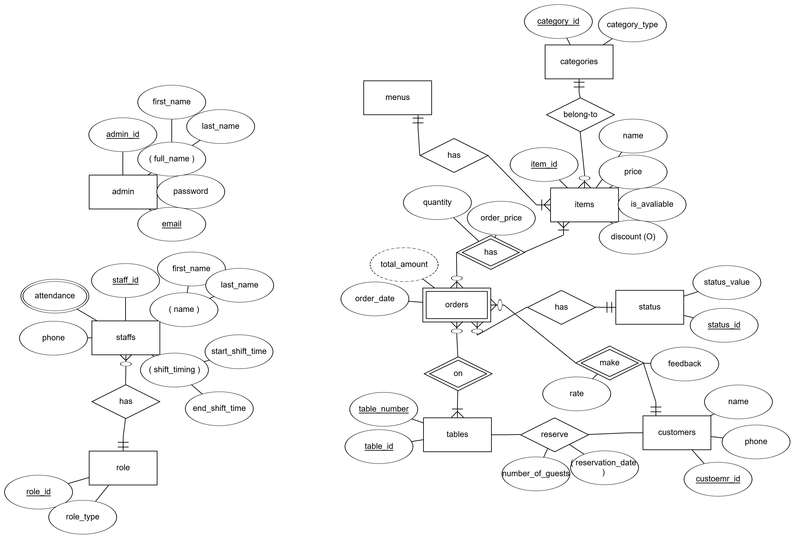

Here’s the updated `README.md` file based on the content of the uploaded file and the provided structure:

---

# Restaurant Management System

## The Scope of the Project

This project aims to develop a comprehensive **Restaurant Management System** that digitalizes restaurant operations. The system will streamline key functionalities such as managing menus, processing orders and bills, handling reservations, and overseeing staff roles, shifts, and attendance. Additionally, it will provide analytical insights into sales trends, staff productivity, and customer satisfaction.

## The Mandatory Objects

- **Admin**: Manages the system, including menu items, categories, discounts, staff roles, shifts, and attendance.
- **Customer**: Interacts with the system to view the menu, place orders, make reservations, and provide feedback.
- **Menu Items**: Represents the food and beverage offerings of the restaurant, including details like name, category, price, availability, and optional discounts.

## The Software Type and the Functionality Follow in the System

### The Software Type

The software is **customized** to meet specific requirements for a restaurant management system.

### The Functionality Followed in the System

#### Admin Functionalities

- Manage **menu items**, **categories**, and **discounts**.
- Oversee **staff roles**, **shifts**, and **attendance**.
- Generate reports on **sales**, **staff performance**, and **reservations**.

#### Customer Functionalities

- View the **menu** and place **orders**.
- Make **table reservations**.
- Provide **feedback** and rate their dining experience.

## Summarize the Objects

- **Menu**: Includes items with attributes like name, category, price, availability, and optional discounts.
- **Order**: Captures details such as table number, customer name (optional), order date, status (e.g., pending, completed), and total amount.
- **Reservation**: Stores customer name, contact details, number of guests, reservation date, and table number.
- **Staff**: Tracks employee name, role (e.g., chef, server), shift timings, attendance, and contact details.
- **Admin**: Manages the system with attributes like username and password.
- **Customer**: Represents customers with attributes like name and contact details.
- **Categories**: Classifies menu items into groups (e.g., "Vegan" and "Appetizers").

### Shared Attributes Across Tables

- `id`: Primary key for each table.
- `created_at`: Timestamp indicating when the record was created.
- `updated_at`: Timestamp indicating when the record was last updated.
- `created_by`: ID of the user who created the record.
- `updated_by`: ID of the user who last updated the record.
- `is_active`: Boolean flag indicating whether the record is active.

## Summarize the Objects Relationships

- **Menu** has a one-to-many relationship with **Menu Items**.
- **Menu Items** can belong to multiple **Categories** (many-to-many relationship).
- **Orders** may include multiple **Menu Items** with quantities (many-to-many relationship).
- **Reservations** should prevent table overbooking by enforcing unique constraints on `reservation_datetime` and `table_id`.

## ERD (Entity Relationship Diagram)

## Relational Database Schema

.png>)

---
